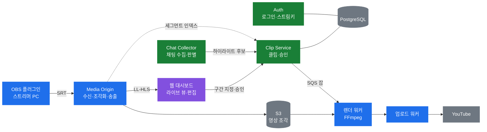

# pokeclip-mono

**스트리머의 실시간 방송에서 하이라이트를 자동으로 찾아 클립으로 만들어 주는 SaaS.**

PokeClip 팀 모노레포. 서버·플러그인·웹·워커가 한 저장소에 있고, CI는 바뀐 것만 검사한다(web·media 모두 워크플로 경로 필터 — ADR-013 모노레포 원칙).
`main`은 `main-source-gate` 체크 하나를 필수로 요구한다(main 대상 PR의 출처가 `develop`·`hotfix/*`인지만 본다). `develop`에는 필수 체크가 없다. media 검사는 필수 체크가 아니며 media 영역이 바뀐 PR에서만 돈다(ADR-0004).

---

## 이 서비스가 무엇인가

방송 중 **채팅**과 **트랙 분리된 음성**을 실시간으로 모아 하이라이트 구간을 찾아내고,
편집·클립 제작·YouTube 업로드까지 한 번에 잇는다.

핵심 차별점은 **게임 이벤트와 채팅 반응의 교차 검증** — 채팅을 "시청자의 실시간 반응 투표"로 쓴다.

### 돈 내는 사람과 쓰는 사람이 다르다

| 구분 | 대상 |
|---|---|
| **고객** (결제) | 치지직·SOOP 메이저 게임 스트리머 (1인 사업자) |
| **사용자** (매일 사용) | 그 스트리머의 **전담 편집자** |

스트리머가 계약하고, 매일 대시보드를 여는 사람은 편집자다.
**권한 모델은 이 분리를 전제로 설계한다.**

MVP 게임은 **LoL 단독**. 이후 발로란트·오버워치·배그로 확장한다.

---

## 전체 흐름



<sub>파랑 = 1번 · 보라 = 2번 · 초록 = 3번 · 회색 = 외부 서비스</sub>

**한 줄 요약:** 방송이 들어오고(1번) → 화면에서 구간을 고르고(2번) → 클립으로 만들어 올린다(3번·1번).

---

## 담당

| 번호 | GitHub | 영역 |
|---|---|---|
| **1번** (팀장) | `@xodbs1021` | 인프라 · 미디어 · 잡 파이프라인 |
| **2번** | `@jaehwan-space` | 프론트 · AI 백엔드 |
| **3번** | `@kth4778` | 데이터 계층 · 코어 API |

경계에 걸친 것은 사람이 아니라 **인터페이스 계약(`contracts/`)에서 만난다.**

---

## 폴더 지도

| 폴더 | 무엇 | 담당 |
|---|---|---|
| [`contracts/`](contracts/) | **서로 주고받는 약속.** 여기를 고치면 3명 전원이 리뷰한다 | 공동 |
| [`services/`](services/) | 서버 4개 (Spring). 로그인 · 클립 · 채팅 수집 · 하이라이트 판별 | 3번 |
| [`media/`](media/) | Media Origin — SRT 수신 · LL-HLS 송출 | 1번 |
| [`obs-plugin/`](obs-plugin/) | OBS 이원 송출 플러그인 (C++) | 1번 |
| [`workers/`](workers/) | 렌더 · 업로드 · AI 자막 | 1번 · 2번 |
| [`web/`](web/) | 웹 대시보드 (React) | 2번 |
| [`infra/`](infra/) | 로컬 compose · IaC | 1번 |
| [`docs/`](docs/) | 개발 환경 등 저장소 문서 | 1번 |

각 폴더의 `README.md`에 그 안에 무엇을 두는지 적혀 있다.

> **설계 문서(ADR·기능명세·역할분담)의 정본은 [`PokeClip-LLM-WIKI`](https://github.com/3K-PokeClip/PokeClip-LLM-WIKI)다.**
> 이 저장소에는 코드와, 코드가 지켜야 할 계약만 둔다.

---

## 로컬 개발 환경

```bash
cp .env.example .env
docker compose up -d
```

상세(포트·송출 테스트·스텁): [docs/dev-environment.md](docs/dev-environment.md)

---

## 규칙

- **`develop`이 통합 브랜치다.** 기능은 `feature/POK-NNN-*`를 `develop`에서 파서 `develop`으로 PR을 올린다
- `main`은 출시 가능한 것만 담는다 — `develop → main` PR(= 릴리스)과 `hotfix/*`로만 들어온다
- `main`·`develop` 둘 다 직접 push가 막혀 있다. hotfix는 `main`에서 파고, 머지 후 `main → develop` 역머지 PR을 반드시 올린다
- 머지는 **merge commit 하나뿐이다**(squash·rebase는 저장소 설정에서 껐다)
- PR은 **기능 하나에 하나**. 줄 수가 아니라 기능이 경계다
- `contracts/`를 고치는 PR에는 **3명 전원이 리뷰어로 붙는다**
- **이 저장소는 public이다.** OAuth 시크릿·AWS 키·서명키는 절대 커밋하지 않는다.
  한 번 커밋하면 지워도 히스토리에 남는다
